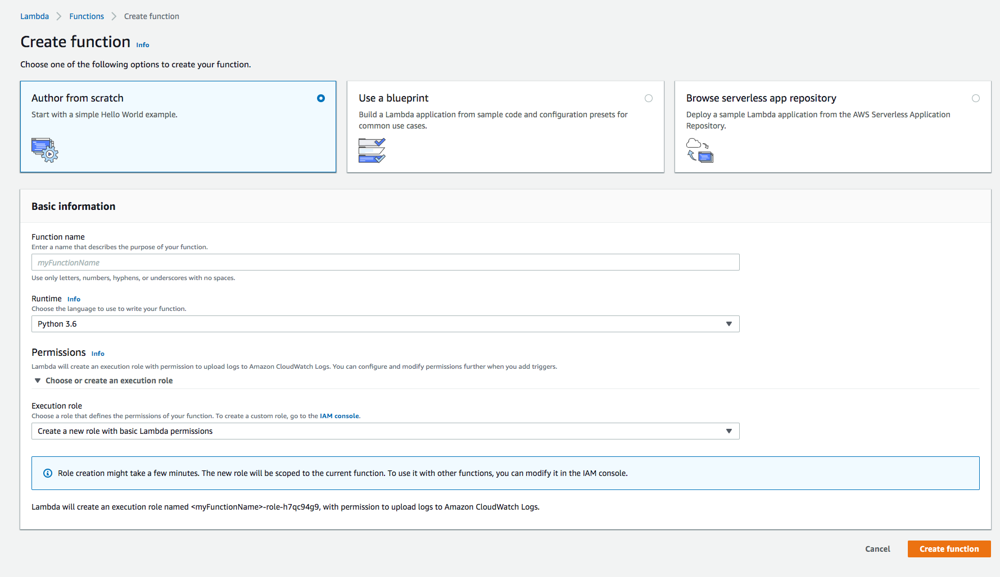

# Creating a Lambda Function

## Overview
An AWS lambda function let's you run code without having a server. It is also known as a server-less function.
We are going to write a lambda function that will be invoked when a user utters one of the phrases entered
in the previous section. The lambda function will know how to handle the response from Alexa and return a response.


## Exercise
1. Go to [https://aws.amazon.com/lambda](https://aws.amazon.com/lambda).
2. Login with the credentials provided.
3. Click the orange `Create function` on the right hand side fo the screen.
4. Next fill in the form with the follow information:


> Name: `alexa-tv-skill`
> Runtime: `Python 3.6`
> Role: `Create a custom role.` Next screen click `Allow`.
5. Click `Create function`
6. Scroll down to the `Function Code` section. Paste in:

```

"""
This sample demonstrates a simple skill built with the Amazon Alexa Skills Kit.
The Intent Schema, Custom Slots, and Sample Utterances for this skill, as well
as testing instructions are located at http://amzn.to/1LzFrj6

For additional samples, visit the Alexa Skills Kit Getting Started guide at
http://amzn.to/1LGWsLG
"""

from __future__ import print_function


# --------------- Helpers that build all of the responses ----------------------

def build_speechlet_response(title, output, reprompt_text, should_end_session):
    return {
        'outputSpeech': {
            'type': 'PlainText',
            'text': output
        },
        'card': {
            'type': 'Simple',
            'title': "SessionSpeechlet - " + title,
            'content': "SessionSpeechlet - " + output
        },
        'reprompt': {
            'outputSpeech': {
                'type': 'PlainText',
                'text': reprompt_text
            }
        },
        'shouldEndSession': should_end_session
    }


def build_response(session_attributes, speechlet_response):
    return {
        'version': '1.0',
        'sessionAttributes': session_attributes,
        'response': speechlet_response
    }


# --------------- Functions that control the skill's behavior ------------------

def get_welcome_response():
    """ If we wanted to initialize the session to have some attributes we could
    add those here
    """

    session_attributes = {}
    card_title = "Welcome"
    speech_output = "Hello. Welcome to the tv skill. " \
                    "I look forward to working with you."

    # If the user either does not reply to the welcome message or says something
    # that is not understood, they will be prompted again with this text.
    reprompt_text = "Hi, again. This is going to be a fun day!"
    should_end_session = False
    return build_response(session_attributes, build_speechlet_response(
        card_title, speech_output, reprompt_text, should_end_session))


def handle_session_end_request():
    card_title = "Session Ended"
    speech_output = "Thank you for trying out this fun new Alexa Skill. " \
                    "Have a nice day! "
    # Setting this to true ends the session and exits the skill.
    should_end_session = True
    return build_response({}, build_speechlet_response(
        card_title, speech_output, None, should_end_session))


def get_tv_show_from_session(intent, session):
    """ If we wanted to initialize the session to have some attributes we could
    add those here
    """

    session_attributes = {}
    card_title = "TV Show"
    speech_output = "My favorite tv show is Silicon Valley. "

    # If the user either does not reply to the welcome message or says something
    # that is not understood, they will be prompted again with this text.
    reprompt_text = "Hi, again. "
    should_end_session = False
    return build_response(session_attributes, build_speechlet_response(
        card_title, speech_output, reprompt_text, should_end_session))


# --------------- Events ------------------

def on_session_started(session_started_request, session):
    """ Called when the session starts """

    print("on_session_started requestId=" + session_started_request['requestId']
          + ", sessionId=" + session['sessionId'])


def on_launch(launch_request, session):
    """ Called when the user launches the skill without specifying what they
    want
    """

    print("on_launch requestId=" + launch_request['requestId'] +
          ", sessionId=" + session['sessionId'])
    # Dispatch to your skill's launch
    return get_welcome_response()


def on_intent(intent_request, session):
    """ Called when the user specifies an intent for this skill """

    print("on_intent requestId=" + intent_request['requestId'] +
          ", sessionId=" + session['sessionId'])

    intent = intent_request['intent']
    intent_name = intent_request['intent']['name']

    # Dispatch to your skill's intent handlers
    if intent_name == "GetFavoriteTvShowIntent":
        return get_tv_show_from_session(intent, session)
    elif intent_name == "AMAZON.HelpIntent":
        return get_welcome_response()
    elif intent_name == "AMAZON.CancelIntent" or intent_name == "AMAZON.StopIntent":
        return handle_session_end_request()
    else:
        raise ValueError("Invalid intent")


def on_session_ended(session_ended_request, session):
    """ Called when the user ends the session.

    Is not called when the skill returns should_end_session=true
    """
    print("on_session_ended requestId=" + session_ended_request['requestId'] +
          ", sessionId=" + session['sessionId'])
    # add cleanup logic here


# --------------- Main handler ------------------

def lambda_handler(event, context):
    """ Route the incoming request based on type (LaunchRequest, IntentRequest,
    etc.) The JSON body of the request is provided in the event parameter.
    """
    print("event.session.application.applicationId=" +
          event['session']['application']['applicationId'])

    """
    Uncomment this if statement and populate with your skill's application ID to
    prevent someone else from configuring a skill that sends requests to this
    function.
    """
    # if (event['session']['application']['applicationId'] !=
    #         "amzn1.echo-sdk-ams.app.[unique-value-here]"):
    #     raise ValueError("Invalid Application ID")

    if event['session']['new']:
        on_session_started({'requestId': event['request']['requestId']},
                           event['session'])

    if event['request']['type'] == "LaunchRequest":
        return on_launch(event['request'], event['session'])
    elif event['request']['type'] == "IntentRequest":
        return on_intent(event['request'], event['session'])
    elif event['request']['type'] == "SessionEndedRequest":
        return on_session_ended(event['request'], event['session'])
```

7. Scroll up in the `Designer` section. Add a trigger. Click `Alexa Skills Kit`. Then click on configure Alexa Skill.
Need to copy Skill Id from [https://developer.amazon.com/alexa](https://developer.amazon.com/alexa)
8. Click Save.

<a href="link.md"> Next link model and lambda function.</a>

