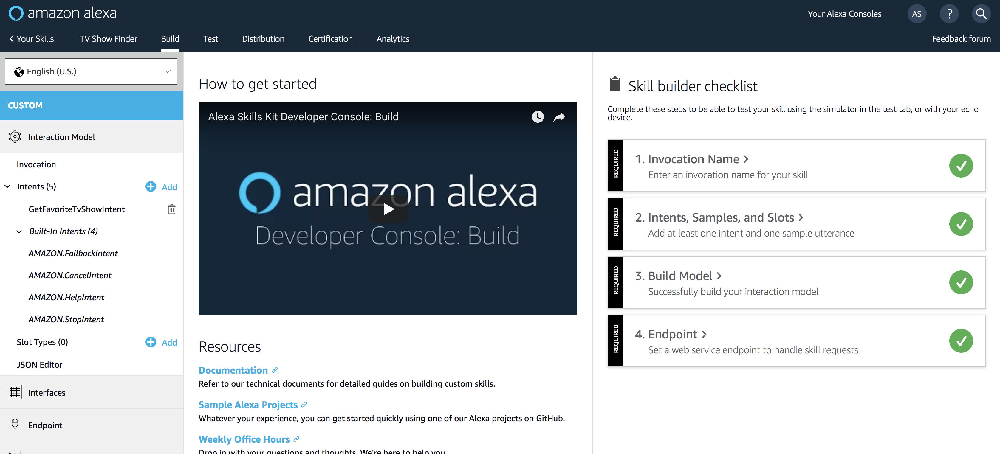

# Link together Model and Lambda Function

## Overview
For this part of the tutorial, we will link together the interaction model and lambda function.

## Exercise
1. Copy Lambda ARN at the top of the Lambda Function page. It will look like: `arn:aws:lambda:us-east-`
2. Go back to the [https://developer.amazon.com/alexa](https://developer.amazon.com/alexa)
Click on the `Endpoint` from the left hand menu.
3. Paste the AWS Lambda ARN in the Default Region box.
4. At the top of the screen, click `Save Endpoint`
5. When you are finished adding the endpoint the right hand-side of the interface should have four green check boxes
(similar to the figure below).
. If all the boxes are checked, continue to the next section.

[Next: Test your Alexa Skill](test.md)

