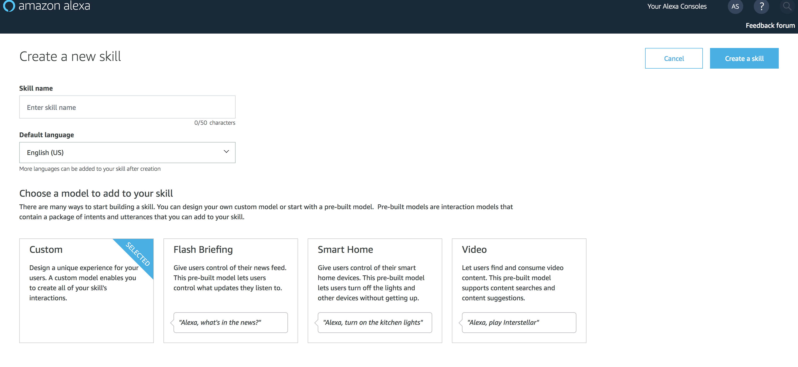

# Creating an Interaction Model

## Overview
For this exercise, we are going to create an interaction model. An interaction model
defines how a user interacts with your skill. You can think of this as the `voice interface`.
To define the voice interface, you map users' *spoken input* to the *intents* your lambda function can handle.

To define the interaction model, you supply the following inputs:

* **Invocation name**: a name that identifies the skill. The user includes this name when initiating a conversation with your skill.
* **Intents**: An intent represents an action that fulfills a user's spoken request. Intents can optionally have arguments called slots.
* **Sample utterances**: A set of likely spoken phrases mapped to the intents. This should include as many representative phrases as possible.


## Exercise
1. Go to: [https://developer.amazon.com/alexa](https://developer.amazon.com/alexa) This is the Amazon developer site providing access to a set of tools
used to develop programs that interact with Amazon.  For our case, we will be using [https://developer.amazon.com/alexa](https://developer.amazon.com/alexa)
to create our Alexa skill.
2. Login into [https://developer.amazon.com/alexa](https://developer.amazon.com/alexa) using the credentials we have supplied.
3. Click on the Toolbar on the top right that says Your Alexa Consoles and click on Skills.

4. Click the **blue** button on the right that says `Create Skill`.
5. Enter skill name: `TV Show Finder` as the model for your skill.
6. Click `Create Skill` button on the right.

7. Now we need to tell Alexa how to invoke our skill. Click `Invocation`. Then type: `tv show finder` (notice only lower case letters). <br>
This is how users will invoke our skill. For example,
 >  User: Alexa, ask TV Show Finder what channel can I find Silicon Valley.
8. Next we need to tell Alexa how we expect users to interact with our skill and what to do when Alexa hears those phrases. We need to
figure out the follow:
> What phrases will users say to interact with our skill? These are the samples.
> What should Alexa do once hearing those phrases? These are the intents.
9.  Click the `JSON Editor` on the left menu. We are going to add our own interaction model as shown below.
10. Select the entire interaction model that shows up in the editor, and delete it. Then copy our interaction model below and paste into
JSON editor.

```java
{
    "interactionModel": {
        "languageModel": {
            "invocationName": "tv show finder",
            "intents": [
                {
                    "name": "AMAZON.FallbackIntent",
                    "samples": []
                },
                {
                    "name": "AMAZON.CancelIntent",
                    "samples": []
                },
                {
                    "name": "AMAZON.HelpIntent",
                    "samples": []
                },
                {
                    "name": "AMAZON.StopIntent",
                    "samples": []
                },
                {
                    "name": "GetFavoriteTvShowIntent",
                    "samples" : [
                      "What is your favorite show",
                      "What is your favorite tv show",
                      "What show do you like the best"

                    ]
                }
            ],
            "types": []
        }
    }
}

```

9. Click `Save Model` at the top of the page. If there are any errors, try to figure out the problem or ask a volunteer to help you out.
10. Once your have saved successfully, then click `Build Model`. This will take a couple of minutes to complete.
11. **IMPORTANT** Click on `Endpoint` from the left-hand side menu. This is where we will specify what Lambda function to call when a user interacts with our Alexa Skill.
For now, just click `Copy to Clipboard` next to your `Your Skill ID`.


[Next: Implement a lambda function](lambda.md)


