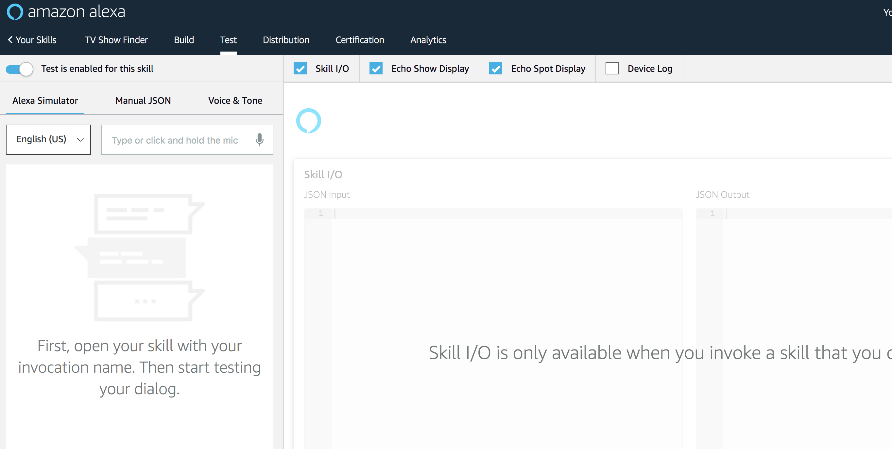

# Test your Alexa Skill

## Exercise
0. Save your lambda function.
1. Go back to [https://developer.amazon.com](https://developer.amazon.com)
2. Click on the Menu item labeled Test at the top of the screen. A test interface similar to the one below should appear.

2. Click and hold the mic icon and say:

> Alexa ask TV Show Finder what channel is  Silicon Valley on?

> Alex ask TV Show Finder what network `FILL-IN-BLANK`

Did it work?

